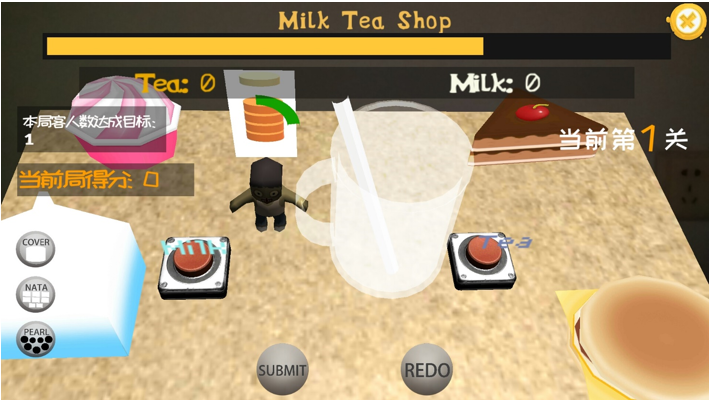
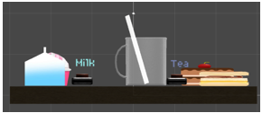
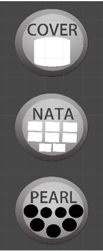
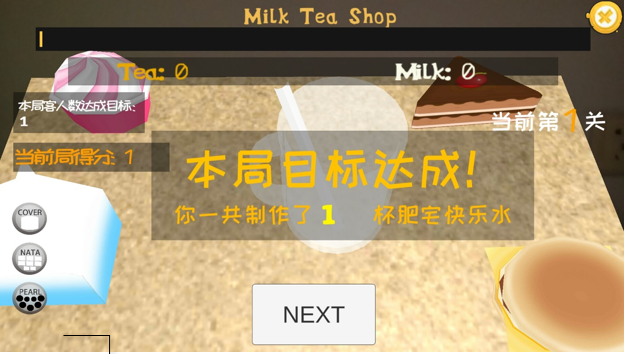
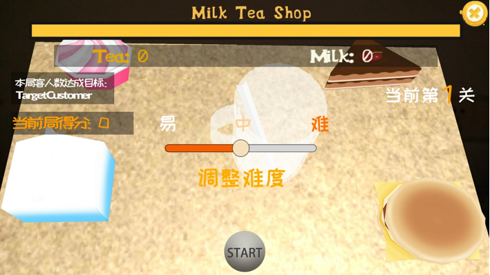
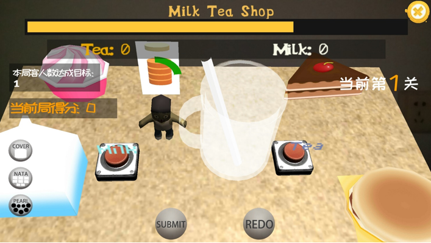
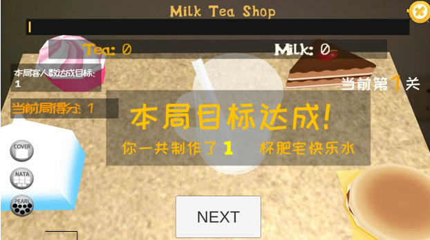
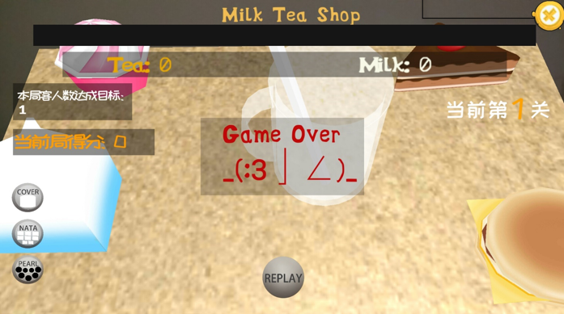
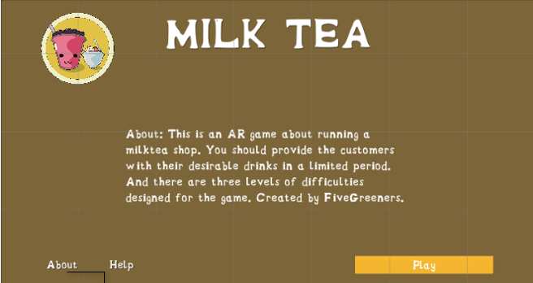
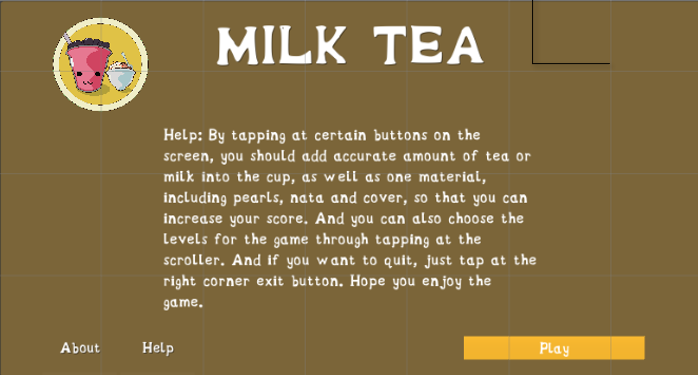

# 游戏设计文档

## 1. 游戏名称

有点甜奶茶

## 2. 游戏概述

### 2.1 游戏简介

这是一款结合AR的模拟经营类游戏。 

玩家扮演一个奶茶店的老板兼服务员，向光临奶茶店的顾客提供奶茶。

玩家需要根据顾客的需求，在顾客的耐心时间内，调制出不同口味的奶茶，满足不同顾客的不同需求。

### 2.2 设计灵感

游戏灵感来源于名为[《poison punch》](https://itunes.apple.com/cn/app/%E6%A2%A6%E5%B9%BB%E8%8D%AF%E5%89%82-potion-punch/id1059695084?mt=8)的一款模拟经营类的游戏。

我们模仿了该游戏的一些核心玩法，并加以变化，通过与AR相结合，赋予其新的独特的游戏风格。

### 2.3 游戏背景

故事发生在美国一个小乡镇的奶茶店上。故事的主人公，也就是奶茶店的老板，厌倦了大城市的生活，回到了年少时所在的乡镇，用自己的积蓄开起了一家小小的奶茶店。

乡镇很小，因而这家在乡镇上独一无二的奶茶店很快就有了一点小小的名声。

每天关顾的人很多，经常排起了队。但店长暂时还雇不起服务员，因此自己每天都要忙得手忙脚乱。

不过他却在这个小小乡镇上的小小奶茶店中，找到了久违的快乐。

### 2.4 游戏特点

* 与AR相结合，玩法比传统游戏更新颖。

* 趣味性强，通过关卡时间限制、顾客需求时间限制，增加游戏紧迫感和刺激感。

* 内容较为丰富，通过难度等级的调节、以及游戏中材料的不同组合，使游戏的变化多样。

* 用户体验好，上手简单，并提供了用户帮助和游戏介绍界面。

### 2.5 目标用户

全年龄段用户

## 3. 游戏设计

[项目初期策划方案](https://github.com/sysu-milktea-team/Document/blob/master/%E6%9C%89%E7%82%B9%E7%94%9C%E5%A5%B6%E8%8C%B6%20%E7%AD%96%E5%88%92%E6%96%87%E6%A1%88(1).md)

### 3.1 核心玩法

* 玩家通过扫描特定的图案召唤出奶茶杯。

* 根据顾客的需求以及所提供的材料，在规定的时间内调制出和规格的奶茶。

* 系统会根据奶茶的成品评判是否符合要求。

* 游戏分为易中难三个难度等级。

### 3.2 游戏机制

#### 3.2.1 关卡计时

每一个关卡有时间限制，玩家需要完成每个关卡的基本要求才能进入下一关。通关失败则可以选择REPLAY重头再来。

#### 3.2.2 制作材料

* 基本材料：牛奶，茶。

* 可选材料：奶盖，椰果，珍珠。

通过配置不同配比的牛奶和茶，以及加入不同的可选材料，可以配制出不同风味的奶茶。

#### 3.2.3 顾客需求

* 需求：不同顾客有不同的口味。他们会想要不同配比的奶茶，有的喜欢奶盖而有的会更喜欢珍珠或椰果。

* 顾客耐心值：顾客有一定的耐心值。不同顾客的耐心值是不同的，且都随时间递减，玩家需要在顾客耐心值消减为0时满足顾客需求才可得分。

### 3.2.4 计分机制

系统会根据需求为标准为制作的奶茶成本进行评估。准确会得分，有错不扣分。

### 3.3 游戏界面

#### 3.3.1 开始界面

#### 3.3.2 顾客需求

#### 3.3.3 通关界面

#### 3.3.4 失败界面

#### 3.3.5 帮助界面

